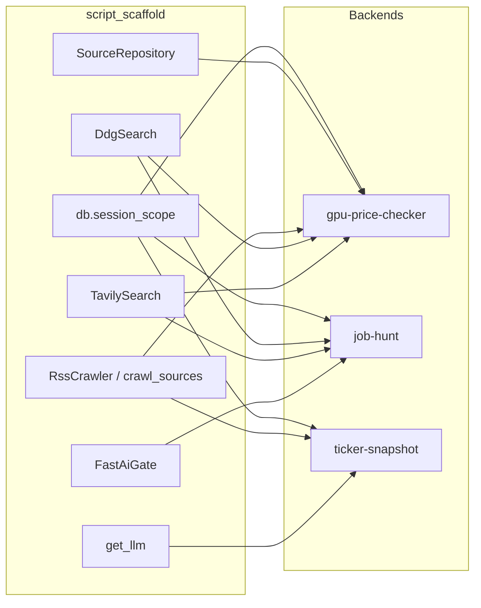

# Shared building blocks

This document explains how **`script_scaffold`** pieces fit together — the primitives Python backends wire for DB sessions, source crawl, web search, fast AI gates, and structured LLM output. It is not an application flow; see consumer **FLOW.md** files for end-to-end daily runs.

---

## Summary

`script_scaffold` is the lowest shared Python layer in this workspace. Backends import it for SQLite session management, RSS crawling into `sources` / `source_items`, DuckDuckGo and Tavily search, lightweight `ai_chat` calls, LangChain `get_llm` for structured pipelines, and reusable `FastAiGate` classification. `price-checker` and domain backends compose these blocks into product-specific pipelines.

---

## How backends compose these blocks

| Backend | Primary scaffold usage |
|---------|------------------------|
| [gpu-price-checker](../gpu-price-checker/gpu-price-checker-backend/FLOW.md) | `session_scope`, `SourceRepository`, `RssCrawler`, `DdgSearch`/`TavilySearch`, `utcnow` |
| [job-hunt](../job-hunt/job-hunt-backend/FLOW.md) | `search_web` helpers, `FastAiGate` pattern in `job_ai_gates`, DB sessions |
| [ticker-snapshot](../ticker-snapshot/stock_evaluator/FLOW.md) | RSS crawl, `get_llm`, search for source discovery |
| [price-checker](../price-checker/FLOW.md) | Re-exports search ABCs; `RetailPriceSearch` uses `DdgSearch`, `TavilySearch`, `SourceRepository` |

---

## Building blocks (by concern)

### Database and sessions

Backends create a SQLite engine and session factory, then wrap transactions with `session_scope` (commit on success, rollback on error).

**In the code:** `db.make_engine`, `db.make_session_factory`, `db.session_scope`, `db.init_tables`

Typical backend pattern: `db.py` defines `get_session()` returning `session_scope(SessionFactory)`.

---

### Sources and crawl

`Source` / `SourceItem` ORM models and `SourceRepository` query sources by scope. `RssCrawler` fetches feeds; `crawl_sources` loops active sources and upserts items.

**In the code:** `models.Source`, `source_repository.SourceRepository`, `rss_crawler.RssCrawler`, `rss_crawler.crawl_sources`

GPU: `gpu_sources.crawl_sources_for_gpu_run`. Stock evaluator: `source_crawler.crawl_sources_for_run`. Job-hunt: `board_crawler.crawl_board_sources`.

---

### Web search

`DdgSearch` and `TavilySearch` implement `BaseSearch.search` with graceful empty results when keys or packages are missing. `search.py` also exposes `ai_chat` for one-shot fast LLM calls (used by gates and validators).

**In the code:** `search.DdgSearch`, `search.TavilySearch`, `search.ai_chat`, `search.BaseSearch`

---

### Fast AI gates

`FastAiGate` is an ABC for single-item boolean classification: build prompt → `ai_chat` with `route=fast` and JSON mode → parse keep/reject. `GateResult` reports whether AI was called. Job-hunt resume/remote/requirement gates follow this pattern (implemented in `job_ai_gates`, not as scaffold subclasses).

**In the code:** `ai_gates.FastAiGate`, `ai_gates.GateResult`, `ai_gates.FastAiGate.evaluate`

---

### Structured LLM (LangChain)

`get_llm` returns a provider-configured LangChain chat model (OpenAI, Anthropic, Ollama, LiteLLM). Stock evaluator analysis modules use this for multi-step structured output.

**In the code:** `llm.get_llm`

---

### Utilities

`utils.utcnow` and helpers are used across backends for consistent timestamps in DB rows and reports.

**In the code:** `script_scaffold.utils`

---

## What this library does not do

- No domain filters (GPU VRAM, job profile matching) — those live in backends or `price-checker`
- No JSON report writers — backends use `content_data_hub` + domain `reporting.py`
- No daily `generate.py` — each consumer defines its own entry script

---

## Related docs

- [`INTENTIONS.md`](INTENTIONS.md) — module-level design notes
- [`README.md`](README.md) — install matrix and API examples
- Consumer flows: [gpu-price-checker](../gpu-price-checker/gpu-price-checker-backend/FLOW.md), [job-hunt](../job-hunt/job-hunt-backend/FLOW.md), [ticker-snapshot](../ticker-snapshot/stock_evaluator/FLOW.md), [price-checker](../price-checker/FLOW.md)
